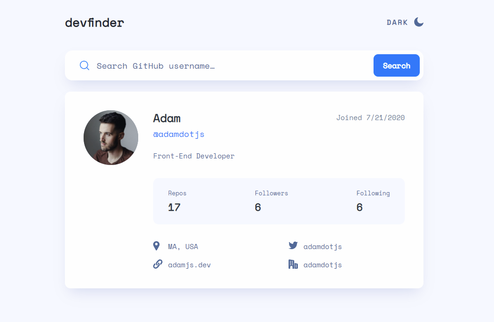

# Frontend Mentor - GitHub user search app solution

This is a solution to the [GitHub user search app challenge on Frontend Mentor](https://www.frontendmentor.io/challenges/github-user-search-app-Q09YOgaH6). Frontend Mentor challenges help you improve your coding skills by building realistic projects.

## Table of contents

- [Overview](#overview)
  - [The challenge](#the-challenge)
  - [Screenshot](#screenshot)
  - [Links](#links)
  - [My process](#my-process)
  - [Built with](#built-with)
  - [What I learned](#what-i-learned)

**Note: Delete this note and update the table of contents based on what sections you keep.**

## Overview

### The challenge

Users should be able to:

- View the optimal layout for the app depending on their device's screen size
- See hover states for all interactive elements on the page
- Search for GitHub users by their username
- See relevant user information based on their search
- Switch between light and dark themes
- **Bonus**: Have the correct color scheme chosen for them based on their computer preferences. _Hint_: Research `prefers-color-scheme` in CSS.

### Screenshot

### Links

- Solution URL: [Add solution URL here](https://your-solution-url.com)
- Live Site URL: [Add live site URL here](https://your-live-site-url.com)

## My process

I first started building out the UI with static data, and then implementing the API afterwards. I find this much easier than trying to do both at once as the API layer adds additional complexity that I don't want getting in my way of styling the app.

### Built with

- React
- Vite
- SWR
- Tailwind CSS

### What I learned

The tablet > desktop layout was tricky with the repositioning of elements. I had to really think about the HTML structure and how everything worked together. I ended up creating two blocks with the same grid columns, which ended up working well in the end.

I used SWR as my data fetching library of choice because I love how simple it is and how because if its caching, if you go back to a previous search the result loads instantly. I learned how to add options such as disabling retrying on error.

I also learned how to use Context and the window.matchMedia API to create a very simple theme switcher.
